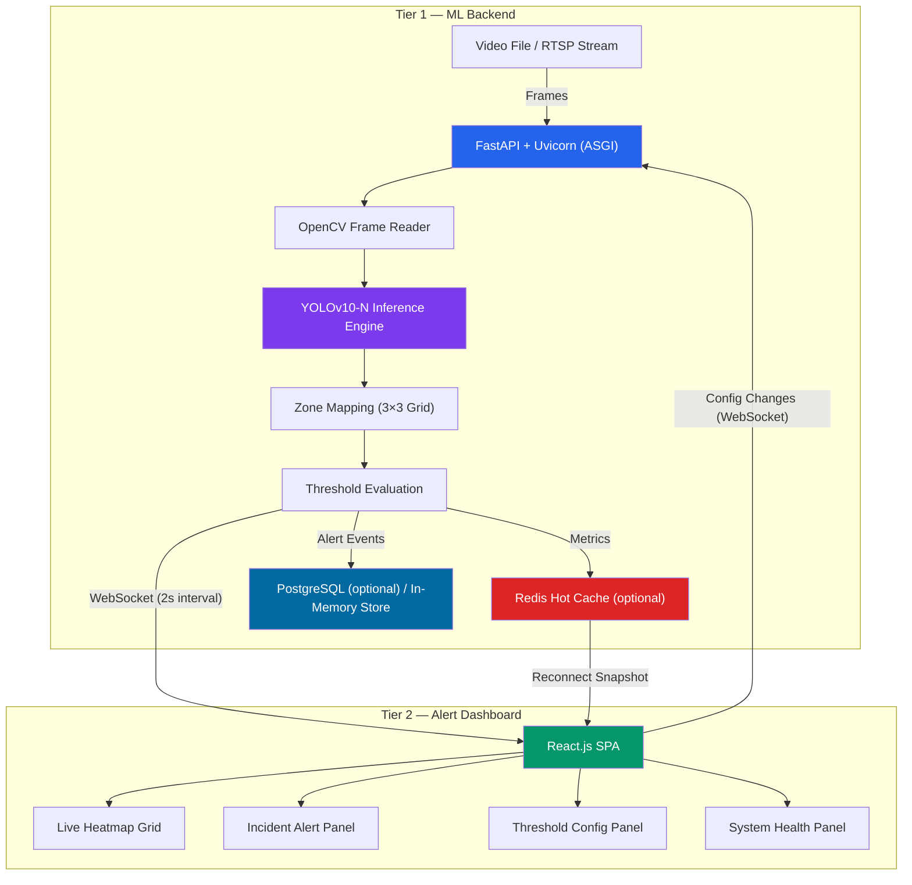
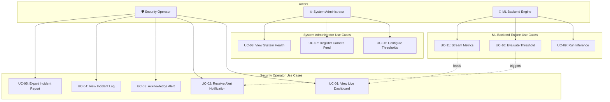
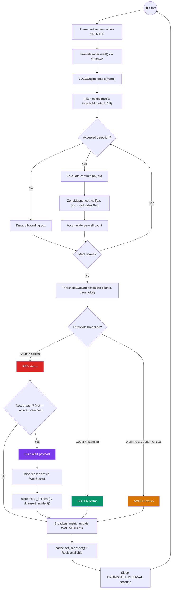
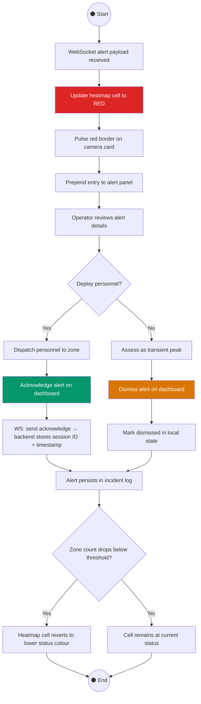
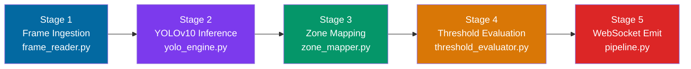
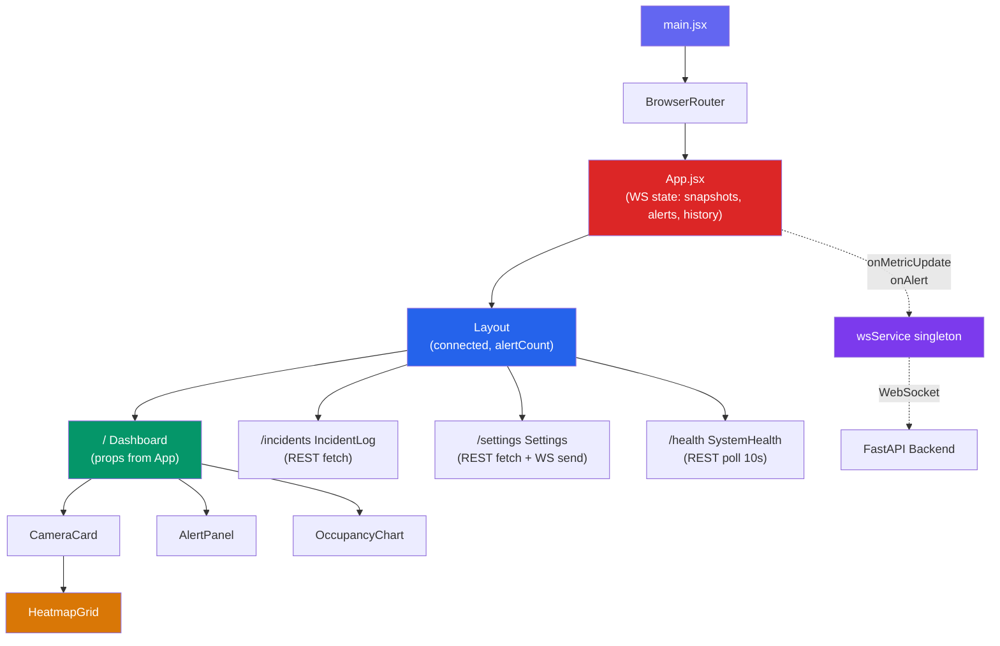
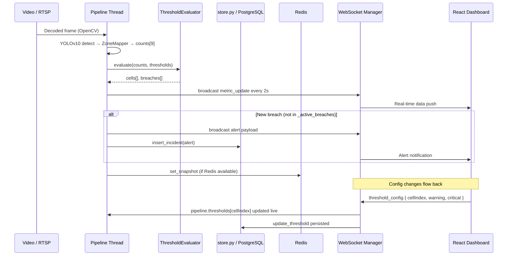

# ARGUS — System Architecture Document

> **Project ARGUS** — Autonomous Real-time Grid-based Urban Surveillance  
> Real-time crowd density monitoring and threshold-based alerting system powered by YOLOv10 inference.

---

## Table of Contents

- [1. Architecture Overview](#1-architecture-overview)
  - [1.1 Tier 1 — ML Backend](#11-tier-1--ml-backend)
  - [1.2 Tier 2 — Alert Dashboard](#12-tier-2--alert-dashboard)
- [2. System Design](#2-system-design)
  - [2.1 Use Case Diagram](#21-use-case-diagram)
  - [2.2 Activity Diagrams](#22-activity-diagrams)
- [3. Technology Stack](#3-technology-stack)
  - [3.1 ML Pipeline — Five-Stage Processing Flow](#31-ml-pipeline--five-stage-processing-flow)
- [4. Alert Dashboard — Feature Specification](#4-alert-dashboard--feature-specification)
- [5. Implementation](#5-implementation)
  - [5.1 Project Structure](#51-project-structure)
  - [5.2 Component Hierarchy](#52-component-hierarchy)
  - [5.3 WebSocket Message Protocol](#53-websocket-message-protocol)
  - [5.4 REST API Endpoint Contract](#54-rest-api-endpoint-contract)
  - [5.5 Routing Map](#55-routing-map)

---

## 1. Architecture Overview

ARGUS follows a **decoupled two-tier model** separating inference from visualisation. The ML backend runs independently of the frontend dashboard, communicating exclusively via WebSocket for real-time alert delivery and REST endpoints for configuration management.



### 1.1 Tier 1 — ML Backend

| Component | Technology | Responsibility |
|-----------|-----------|----------------|
| Application Server | FastAPI + Uvicorn (ASGI) | Video frame ingestion, API routing, WebSocket management |
| Inference Engine | YOLOv10-N (Ultralytics) | Person detection (class 0 only) on decoded video frames |
| Zone Mapper | `inference/zone_mapper.py` | Centroid pixel → 3×3 grid cell index (row-major) |
| Threshold Evaluator | `inference/threshold_evaluator.py` | Per-cell count vs. configured Warning/Critical thresholds |
| Alert Streamer | WebSocket (native FastAPI) | Real-time metric and alert payload delivery every 2s |
| In-Memory Store | `store.py` | Camera, incident, and threshold persistence when no DB is available |
| Hot Cache | Redis | Latest per-camera metric snapshot for dashboard reconnection (optional) |
| Persistent Store | PostgreSQL via asyncpg | Alert event persistence and threshold configuration (optional) |

> **Graceful Degradation:** The system runs fully without PostgreSQL or Redis. When `DATABASE_URL` is not set, all reads and writes go to `store.py` (in-memory). When `REDIS_URL` is not set, the cache layer is a no-op. No data is lost within a session.

### 1.2 Tier 2 — Alert Dashboard

| Component | Technology | Responsibility |
|-----------|-----------|----------------|
| SPA Framework | React 18 + Vite | Single-page alert dashboard with real-time state management |
| State Root | `App.jsx` | WebSocket state (snapshots, alerts, history) lifted here — persists across page navigation |
| Styling | Tailwind CSS | Responsive layout, heatmap cell colour transitions |
| Charts | Recharts | Live occupancy trend graphs |
| Communication | WebSocket singleton (`api.js`) | Bidirectional channel — receives alerts, sends config changes |
| REST Client | `fetch()` in `api.js` | Camera registration, incident log, health polling |

**Connection Lifecycle:**

1. On initial WebSocket connection, the dashboard receives the **current snapshot** from Redis cache (if available) or the latest pipeline result.
2. The pipeline broadcasts **metric updates every 2 seconds**. Alerts fire only when a cell **newly enters** a breach state — no duplicate spam on sustained breach.
3. **Threshold configuration changes** are sent back to the backend via the same WebSocket channel and applied to the running pipeline immediately with no restart.
4. WS state lives in `App.jsx` — navigating to Incident Log, Settings, or Health pages and back does **not** reset dashboard data.

---

## 2. System Design

### 2.1 Use Case Diagram

ARGUS identifies **two primary human actors** and **one system-level actor**:



#### Actor Descriptions

| Actor | Role | Description |
|-------|------|-------------|
| **Security Operator** | Human | Monitors live camera feeds, views active alerts, acknowledges incidents. |
| **System Administrator** | Human (Privileged) | Registers camera feeds (RTSP/video file), configures per-zone thresholds, monitors system health (FPS, WS clients, DB status). |
| **ML Backend Engine** | System | Continuously processes video frames, runs YOLOv10 inference, evaluates zone thresholds, emits WebSocket events. |

---

#### Use Cases — Security Operator

| ID | Use Case | Description | Status |
|----|----------|-------------|--------|
| **UC-01** | View Live Dashboard | Real-time heatmap of all registered cameras and zone occupancy states. | ✅ Implemented |
| **UC-02** | Receive Alert Notification | Visual alert on heatmap cell breach; alert panel entry prepended. | ✅ Implemented |
| **UC-03** | Acknowledge Alert | Logs operator session ID and acknowledgement timestamp via WebSocket. | ✅ Implemented |
| **UC-04** | View Incident Log | Chronological breach log filterable by camera, severity, date range. | ✅ Implemented |
| **UC-05** | Export Incident Report | Filtered incident log downloadable as CSV. | ✅ Implemented |

#### Use Cases — System Administrator

| ID | Use Case | Description | Status |
|----|----------|-------------|--------|
| **UC-06** | Configure Thresholds | Warning (amber) and Critical (red) thresholds per camera per zone cell; applied to running pipeline with no restart. | ✅ Implemented |
| **UC-07** | Register Camera Feed | Add RTSP stream or video file source; assigned name and venue label. | ✅ Implemented |
| **UC-08** | View System Health | Inference FPS per camera, WebSocket client count, DB status, cache status, uptime, backend latency. | ✅ Implemented |

#### Use Cases — ML Backend Engine

| ID | Use Case | Description | Status |
|----|----------|-------------|--------|
| **UC-09** | Run Inference | Per-frame YOLOv10-N person detection; centroids mapped to 3×3 grid. | ✅ Implemented |
| **UC-10** | Evaluate Threshold | Per-cell counts vs. thresholds; breach triggers alert only on state transition. | ✅ Implemented |
| **UC-11** | Stream Metrics | Broadcasts metric updates every `BROADCAST_INTERVAL` seconds to all WS clients. | ✅ Implemented |

---

### 2.2 Activity Diagrams

#### 2.2.1 Activity Diagram 1 — Video Processing and Alert Pipeline



**Pipeline Summary:**

1. **Frame Ingestion** — `FrameReader` wraps OpenCV; loops the video on EOF for continuous demo playback.
2. **YOLOv10 Inference** — Detects only class 0 (person); boxes below confidence threshold discarded.
3. **Zone Mapping** — Centroid pixel divided by frame dimensions → row-major 3×3 cell index (0–8).
4. **Threshold Evaluation** — Green / Amber / Red per cell based on Warning and Critical thresholds.
5. **Alert Deduplication** — `_active_breaches: set[int]` tracks currently breaching cells. An alert fires **only when a cell newly enters** breach — not on every tick while it remains breached.
6. **Persistence** — Incidents written to `store.py` (always) and PostgreSQL (if connected). Snapshot written to Redis (if connected).

---

#### 2.2.2 Activity Diagram 2 — Operator Alert Response



---

## 3. Technology Stack

| Layer | Technology | Purpose |
|-------|-----------|---------|
| **ML / Vision** | Python 3.11+ | Primary backend language |
| | PyTorch | Deep learning runtime for YOLOv10 |
| | OpenCV (`opencv-python-headless`) | Frame decoding, video file and RTSP support |
| | Ultralytics YOLOv10-N | Person detection; auto-downloads `yolov10n.pt` on first run |
| **Backend API** | FastAPI | Async API server; WebSocket + REST endpoint management |
| | Uvicorn (ASGI) | High-performance async server |
| | asyncpg | Async PostgreSQL driver |
| | redis-py | Async Redis client |
| **Data Layer** | `store.py` | In-memory camera/incident/threshold store — active when no DB |
| | PostgreSQL | Persistent storage (optional) |
| | Redis | Snapshot hot cache for WS reconnection (optional) |
| **Frontend** | React 18 | Single-page dashboard |
| | Vite | Build tool with HMR |
| | React Router 7 | Client-side routing |
| | Tailwind CSS 4 | Responsive styling; heatmap cell colour transitions |
| | Recharts | Live occupancy trend chart |
| | Lucide React | Icon system |
| **DevOps** | Docker + Compose | Full containerisation (postgres + redis + backend) |

---

### 3.1 ML Pipeline — Five-Stage Processing Flow



| Stage | Module | Input | Output |
|-------|--------|-------|--------|
| **1** | `frame_reader.py` | Video file / RTSP stream | Raw decoded frame; loops on EOF |
| **2** | `yolo_engine.py` | Decoded frame | Bounding boxes + confidence scores (class 0 only) |
| **3** | `zone_mapper.py` | Accepted bounding boxes | Per-cell count list (9 cells, row-major) |
| **4** | `threshold_evaluator.py` | Per-cell counts | `cells: list[dict]` with severity + `breaches: list[dict]` |
| **5** | `pipeline.py` | Cells + breaches | `metric_update` broadcast every interval; `alert` on new breach |

---

## 4. Alert Dashboard — Feature Specification

### 4.1 Live Camera Grid

| Feature | Description |
|---------|-------------|
| Camera Card | Name, total occupancy, 3×3 heatmap grid with per-cell counts, status badge |
| Colour Transitions | **Green** (below warning) · **Amber** (warning–critical) · **Red** (critical+) |
| Alert Animation | Card flashes red border pulse on active critical alert |
| State Persistence | WS state lives in `App.jsx` — navigating away and back does not reset data |

### 4.2 Incident Alert Panel

| Feature | Description |
|---------|-------------|
| Layout | Reverse-chronological list of active and recent alerts |
| Entry Fields | Timestamp · Camera · Cell index · Count · Severity badge · Acknowledge / Dismiss buttons |
| Deduplication | Alert fires only on state transition into breach, not on every tick |

### 4.3 System Administrator — Threshold Configuration

| Feature | Description |
|---------|-------------|
| Granularity | Per-camera, per-cell Warning and Critical thresholds (9 cells per camera) |
| Live Update | Changes sent via WebSocket → applied to running pipeline immediately |
| Defaults | Sourced from `.env` (`WARN_THRESHOLD` / `CRITICAL_THRESHOLD`) |

### 4.4 System Administrator — Camera Registration

| Feature | Description |
|---------|-------------|
| Source Types | RTSP stream URL or local video file path |
| Fields | Camera name · Venue / zone label · Source (RTSP URL or file path) |
| Storage | Written to `store.py` (in-memory) and PostgreSQL if connected |

### 4.5 System Health Monitoring

| Metric | Source |
|--------|--------|
| Backend status | `/api/health` response |
| Backend latency | Client-side `performance.now()` around fetch |
| WebSocket clients | Live count from ConnectionManager |
| Uptime | Server start time delta |
| Inference FPS | `pipeline._current_fps` (updated every second in inference thread) |
| DB status | `db.is_available()` — PostgreSQL connected vs. in-memory fallback |
| Cache status | `cache.is_available()` — Redis connected vs. no-op |

### 4.6 Incident Log and Export

| Feature | Description |
|---------|-------------|
| Stored Metadata | Camera ID/name · Venue · Cell index · Count · Threshold · Severity · Timestamp · Acknowledgement |
| Filtering | Camera (dynamic from API) · Severity · Date range |
| Export | Filtered results as CSV via `StreamingResponse` |
| Empty state | Shows informative message until first real breach — no fake data |

---

## 5. Implementation

### 5.1 Project Structure

```
ARGUS/
├── backend/
│   ├── main.py                    # FastAPI app, lifespan, WS endpoint, config from .env
│   ├── manager.py                 # WebSocket ConnectionManager (broadcast / send / count)
│   ├── db.py                      # asyncpg layer — delegates to store.py when no pool
│   ├── store.py                   # In-memory camera/incident/threshold store
│   ├── cache.py                   # Redis layer — no-op when unavailable
│   ├── schemas.py                 # Pydantic models
│   ├── mock.py                    # Mock data generators (kept for reference)
│   ├── inference/
│   │   ├── pipeline.py            # Daemon thread + async broadcast loop; alert deduplication
│   │   ├── frame_reader.py        # OpenCV reader; loops on EOF for continuous playback
│   │   ├── yolo_engine.py         # YOLOv10-N wrapper (person class 0 only)
│   │   ├── zone_mapper.py         # Centroid pixel → 3×3 row-major cell index
│   │   └── threshold_evaluator.py # Warning / Critical classification per cell
│   ├── routers/
│   │   ├── cameras.py             # GET /api/cameras · POST /api/cameras
│   │   ├── incidents.py           # GET /api/incidents · GET /api/incidents/export (CSV)
│   │   └── health.py              # GET /api/health (FPS, WS count, DB/cache status, uptime)
│   └── videos/                    # Place demo.mp4 here (gitignored)
├── frontend/
│   └── src/
│       ├── App.jsx                # WS state root (snapshots, alerts, history) — never unmounts
│       ├── pages/
│       │   ├── Dashboard.jsx      # Receives live data as props; no local WS subscription
│       │   ├── IncidentLog.jsx    # Camera filter populated from /api/cameras
│       │   ├── Settings.jsx       # Threshold config + camera registration (RTSP / video file)
│       │   └── SystemHealth.jsx   # FPS, latency, WS clients, DB status, cache status
│       ├── components/
│       │   ├── Layout.jsx
│       │   ├── CameraCard.jsx
│       │   ├── HeatmapGrid.jsx
│       │   ├── AlertPanel.jsx
│       │   └── OccupancyChart.jsx
│       └── services/
│           └── api.js             # WebSocketService singleton + RestAPI (real fetch calls)
└── docker-compose.yml             # postgres:16-alpine + redis:7-alpine + backend
```

### 5.2 Component Hierarchy



### 5.3 WebSocket Message Protocol

#### Server → Client

| Type | Payload | Trigger |
|------|---------|---------|
| `metric_update` | `CameraSnapshot[]` | Every `BROADCAST_INTERVAL` seconds |
| `alert` | `AlertPayload` | When a cell newly enters breach state |

**CameraSnapshot:**
```json
{
  "cameraId": "cam-001",
  "cameraName": "Mall Hallway",
  "venue": "Main Hall",
  "status": "online",
  "fps": 24.1,
  "totalOccupancy": 12,
  "cells": [
    { "cellIndex": 0, "count": 3, "severity": "green" },
    { "cellIndex": 4, "count": 6, "severity": "critical" }
  ]
}
```

#### Client → Server

| Type | Payload | Effect |
|------|---------|--------|
| `threshold_config` | `{ cameraId, cellIndex, warning, critical }` | Updates `pipeline.thresholds[cellIndex]` immediately; persists to store/DB |
| `acknowledge` | `{ alertId, sessionId, timestamp }` | Marks incident acknowledged in store/DB |

### 5.4 REST API Endpoint Contract

| Method | Endpoint | Description |
|--------|----------|-------------|
| `GET` | `/api/cameras` | All cameras from store/DB |
| `POST` | `/api/cameras` | Register new camera (name, venue, rtspUrl/videoSource) |
| `GET` | `/api/incidents` | Filtered incident log (`?cameraId=&severity=&startDate=&endDate=`) |
| `GET` | `/api/incidents/export` | CSV download of filtered incidents |
| `GET` | `/api/health` | FPS, uptime, WS count, DB status, cache status, per-camera health |
| `GET` | `/` | Service info (mode: ml/mock, video_source, db, cache) |

### 5.5 Routing Map

| Path | Page | Use Cases | Live Data Source |
|------|------|-----------|-----------------|
| `/` | Dashboard | UC-01, UC-02, UC-03 | WebSocket `metric_update` + `alert` (state in App.jsx) |
| `/incidents` | IncidentLog | UC-04, UC-05 | `GET /api/incidents` (store/DB) |
| `/settings` | Settings | UC-06, UC-07 | `GET /api/cameras` + WS `threshold_config` |
| `/health` | SystemHealth | UC-08 | `GET /api/health` (polled every 10s) |

---

## Appendix — Data Flow Summary



---

*Document version: 2.0 · Last updated: June 2026 · Implementation complete*
