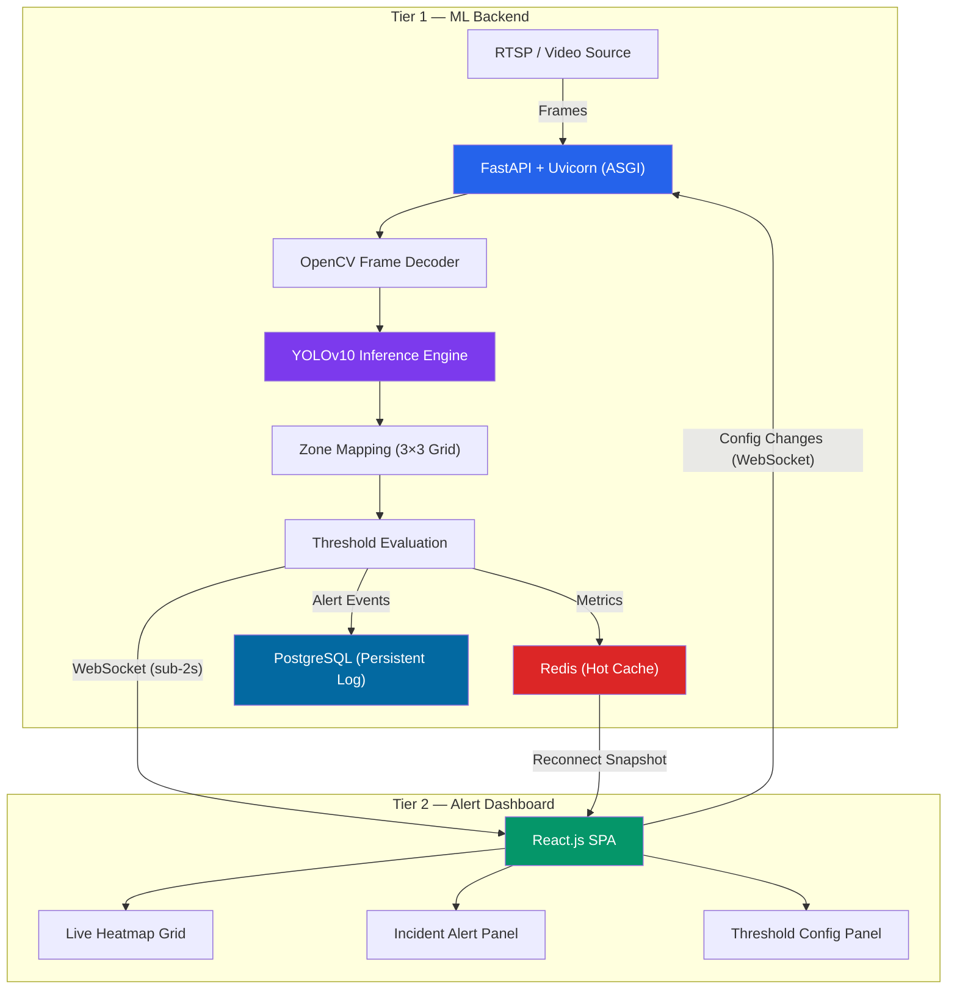
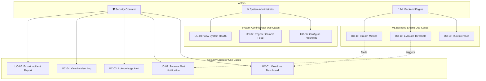
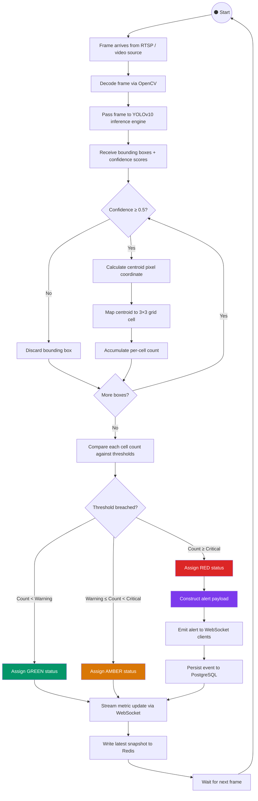
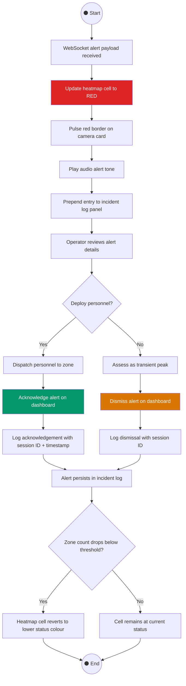
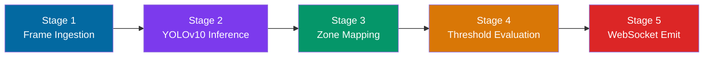
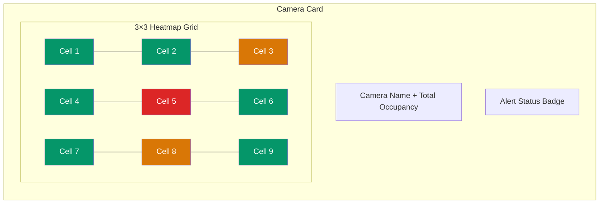
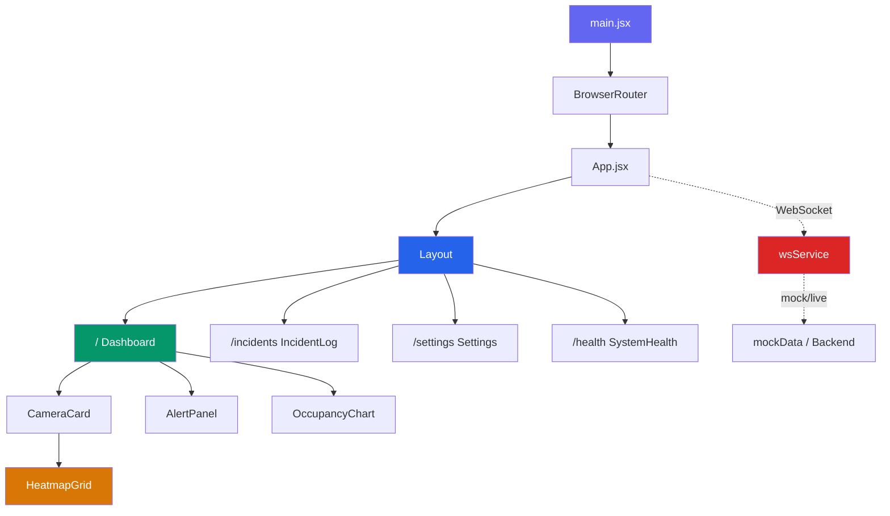
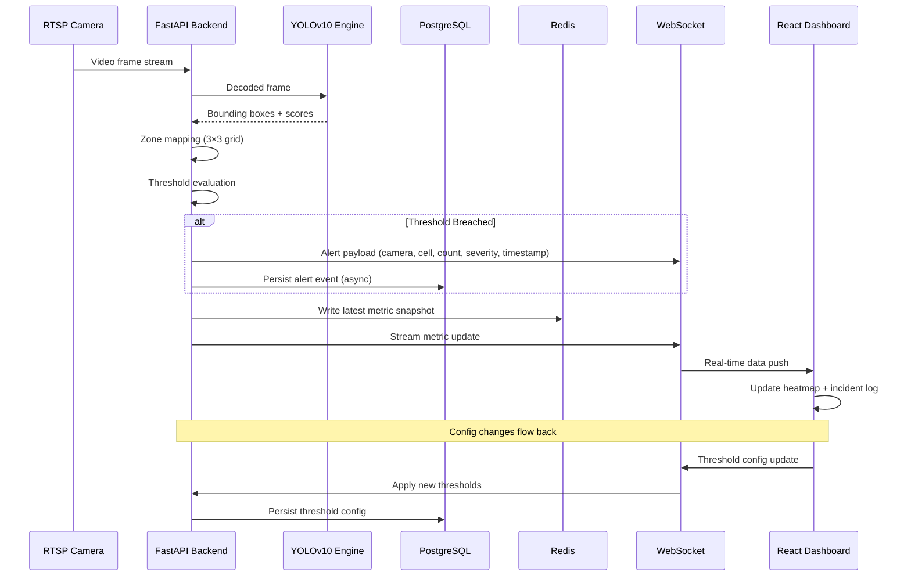

# ARGUS — System Architecture Document

> **Project ARGUS** — Autonomous Real-time Grid-based Urban Surveillance  
> Real-time crowd density monitoring and threshold-based alerting system powered by YOLOv10 inference.

---

## Table of Contents

- [1. Architecture Overview](#1-architecture-overview)
  - [1.1 Tier 1 — ML Backend](#11-tier-1--ml-backend)
  - [1.2 Tier 2 — Alert Dashboard](#12-tier-2--alert-dashboard)
- [2. System Design](#2-system-design)
  - [2.1 Use Case Diagram](#21-use-case-diagram)
  - [2.2 Activity Diagrams](#22-activity-diagrams)
- [3. Technology Stack](#3-technology-stack)
  - [3.1 ML Pipeline — Five-Stage Processing Flow](#31-ml-pipeline--five-stage-processing-flow)
- [4. Alert Dashboard — Feature Specification](#4-alert-dashboard--feature-specification)
- [5. Frontend Implementation](#5-frontend-implementation)
  - [5.1 Project Structure](#51-project-structure)
  - [5.2 Component Hierarchy](#52-component-hierarchy)
  - [5.3 WebSocket Message Protocol](#53-websocket-message-protocol)
  - [5.4 REST API Endpoint Contract](#54-rest-api-endpoint-contract)
  - [5.5 Routing Map](#55-routing-map)

---

## 1. Architecture Overview

ARGUS follows a **decoupled two-tier model** separating inference from visualisation. The ML backend runs independently of the frontend dashboard, communicating exclusively via WebSocket for real-time alert delivery and REST endpoints for configuration management.



### 1.1 Tier 1 — ML Backend

| Component | Technology | Responsibility |
|-----------|-----------|----------------|
| Application Server | FastAPI + Uvicorn (ASGI) | Video frame ingestion, API routing, WebSocket management |
| Inference Engine | YOLOv10 (Ultralytics) + PyTorch | Person detection on decoded video frames |
| Zone Mapper | Custom Python module | Centroid-to-grid-cell mapping (3×3) |
| Threshold Evaluator | Custom Python module | Per-cell count vs. configured Warning/Critical thresholds |
| Alert Streamer | WebSocket (native FastAPI) | Real-time metric and alert payload delivery |
| Hot Cache | Redis | Latest per-camera metric snapshot for dashboard reconnection |
| Persistent Store | PostgreSQL | Asynchronous alert event persistence and threshold configuration |

### 1.2 Tier 2 — Alert Dashboard

| Component | Technology | Responsibility |
|-----------|-----------|----------------|
| SPA Framework | React.js | Single-page alert dashboard with real-time state management |
| Styling | Tailwind CSS | Responsive layout, heatmap cell colour transitions |
| Charts | Recharts | Live occupancy trend graphs and historical data visualisation |
| Communication | WebSocket Client | Bidirectional channel — receives alerts, sends config changes |

**Connection Lifecycle:**

1. On initial WebSocket connection, the dashboard receives the **current state** of all cameras (sourced from Redis cache).
2. On each **alert event**, the dashboard updates the relevant heatmap cell and prepends the incident to the log panel.
3. **Threshold configuration changes** are sent back to the backend via the same WebSocket channel — no page reload or server restart required.

---

## 2. System Design

### 2.1 Use Case Diagram

ARGUS identifies **two primary human actors** and **one system-level actor**:



#### Actor Descriptions

| Actor | Role | Description |
|-------|------|-------------|
| **Security Operator** | Human | Authorised security personnel who monitors live camera feeds, views active alerts, acknowledges incidents, and navigates to specific camera zones. |
| **System Administrator** | Human (Privileged) | Configures per-camera, per-zone occupancy thresholds, registers new camera feeds, and exports incident logs for post-event review. |
| **ML Backend Engine** | System | Continuously processes video frames, runs YOLOv10 inference, evaluates zone thresholds, and emits WebSocket alert events. |

---

#### Use Cases — Security Operator

| ID | Use Case | Description |
|----|----------|-------------|
| **UC-01** | View Live Dashboard | Operator opens the React dashboard and sees the real-time heatmap of all registered cameras and their current zone occupancy states. |
| **UC-02** | Receive Alert Notification | When a zone threshold is breached, the operator receives an immediate visual alert (red flash on heatmap cell, alert panel entry, audio tone). |
| **UC-03** | Acknowledge Alert | Operator clicks to acknowledge an active alert, logging their session ID and acknowledgement timestamp. |
| **UC-04** | View Incident Log | Operator views the chronological log of all past breach events filterable by camera, zone, and date range. |
| **UC-05** | Export Incident Report | Operator exports the filtered incident log as a CSV file for post-event analysis or reporting. |

#### Use Cases — System Administrator

| ID | Use Case | Description |
|----|----------|-------------|
| **UC-06** | Configure Thresholds | Administrator sets Warning (amber) and Critical (red) occupancy thresholds per camera, per zone cell, from the dashboard settings panel. |
| **UC-07** | Register Camera Feed | Administrator adds a new RTSP stream or video source and assigns it a name and venue zone label. |
| **UC-08** | View System Health | Administrator monitors backend connection status, inference FPS per camera, and WebSocket client count. |

#### Use Cases — ML Backend Engine

| ID | Use Case | Description |
|----|----------|-------------|
| **UC-09** | Run Inference | On each incoming frame, detects all persons using YOLOv10 and maps bounding box centroids to 3×3 grid cells. |
| **UC-10** | Evaluate Threshold | Per-cell counts are compared against configured thresholds; any breach triggers alert payload construction and emission. |
| **UC-11** | Stream Metrics | Continuously streams per-cell occupancy metrics to all connected dashboard clients over WebSocket. |

---

### 2.2 Activity Diagrams

#### 2.2.1 Activity Diagram 1 — Video Processing and Alert Pipeline



**Pipeline Summary:**

1. **Frame Ingestion** — Raw frame arrives from a registered RTSP stream or video file source and is decoded by OpenCV.
2. **YOLOv10 Inference** — Returns bounding boxes for all detected persons; boxes below confidence threshold (default `0.5`) are discarded.
3. **Zone Mapping** — Each accepted bounding box centroid is mapped to one of nine cells in the 3×3 grid based on its pixel position relative to frame dimensions.
4. **Threshold Evaluation** — Per-cell counts are compared against configured Warning and Critical thresholds:
   - **Green** — Count below Warning threshold
   - **Amber** — Count between Warning and Critical thresholds
   - **Red** — Count at or above Critical threshold → triggers alert payload
5. **WebSocket Emit** — Alert payload (camera ID, cell index, count, threshold exceeded, severity, UTC timestamp) is emitted to all connected clients. Event is persisted to PostgreSQL, and the latest metric snapshot is written to Redis.

---

#### 2.2.2 Activity Diagram 2 — Operator Alert Response



**Operator Response Summary:**

- Dashboard receives alert → heatmap updates to red, border flashes, audio plays, log entry prepended.
- Operator reviews and either **acknowledges** (dispatches personnel) or **dismisses** (transient peak assessment).
- Both actions are permanently logged with session ID.
- When the zone count drops below threshold in a subsequent frame, the heatmap cell **automatically reverts** to its lower status colour.

---

## 3. Technology Stack

### Complete Technology Stack

| Layer | Technology | Purpose |
|-------|-----------|---------|
| **ML / Vision** | Python 3.11+ | Primary backend language for ML pipeline |
| | PyTorch | Deep learning inference runtime for YOLOv10 |
| | OpenCV | Frame decoding, resizing, and pre-processing |
| | Ultralytics YOLOv10-N/S | Person detection; head-and-shoulder optimised for occluded crowds |
| **Backend API** | FastAPI | Async API server; WebSocket endpoint management |
| | Uvicorn (ASGI) | High-performance async server for sustained WebSocket connections |
| | WebSockets | Persistent bidirectional channel for sub-2s alert delivery |
| **Data Layer** | PostgreSQL | Persistent incident log storage and threshold configuration |
| | Redis | Hot cache for latest per-camera metric snapshot on dashboard reconnect |
| **Frontend** | React.js 19 | Single-page alert dashboard with WebSocket client |
| | Vite 8 | Build tool and dev server with HMR |
| | React Router 7 | Client-side routing between dashboard views |
| | Tailwind CSS 4 | Responsive styling; heatmap cell colour transitions |
| | Recharts | Live occupancy trend graphs and historical resolution charts |
| | Lucide React | Consistent icon system across all UI components |
| **DevOps** | Docker | Full system containerisation for reproducible cloud and edge deployment |
| | GCP Cloud Run | Serverless cloud hosting with min-instance configuration to eliminate cold starts |
| **Edge (Phase 2+)** | NVIDIA Jetson | On-premises edge deployment; sub-10ms local inference, zero internet dependency |

---

### 3.1 ML Pipeline — Five-Stage Processing Flow



| Stage | Component | Input | Output |
|-------|-----------|-------|--------|
| **1** | Frame Ingestion | RTSP stream / video file | Raw decoded frame via OpenCV |
| **2** | YOLOv10 Inference | Decoded frame | Bounding boxes + confidence scores for all detected persons |
| **3** | Zone Mapping | Accepted bounding boxes | Each centroid assigned to its 3×3 grid cell |
| **4** | Threshold Evaluation | Per-cell counts | Warning/Critical severity status per cell |
| **5** | WebSocket Emit | Status + counts | Metric update (all frames) + alert payload (breach frames) pushed to clients |

> [!NOTE]
> Each stage has a **single testable responsibility**, enabling isolated unit testing and independent optimisation.

---

## 4. Alert Dashboard — Feature Specification

### 4.1 Live Camera Grid



| Feature | Description |
|---------|-------------|
| Camera Card | Each active camera displays: name, current total occupancy, 3×3 heatmap grid with per-cell counts, alert status badge. |
| Colour Transitions | Real-time transitions — **Green** (0–40% of Warning), **Amber** (41–80%), **Red** (above Critical). |
| Alert Animation | Cards flash a **red border pulse** when a Critical alert is active on that camera. |

### 4.2 Incident Alert Panel

| Feature | Description |
|---------|-------------|
| Layout | Persistent panel listing all active and recent alerts in **reverse-chronological** order. |
| Alert Entry Fields | UTC timestamp, Camera ID, Cell index, Count at breach, Severity badge (Warning / Critical), Acknowledge button. |
| Acknowledgement | Logs operator session ID and acknowledgement timestamp. |

### 4.3 Threshold Configuration

| Feature | Description |
|---------|-------------|
| Granularity | Per-camera, per-cell Warning and Critical thresholds. |
| Live Update | Configurable from the dashboard settings panel **without server restart**. |
| Defaults | Warning: **10 persons/cell** · Critical: **20 persons/cell** |

### 4.4 Incident Log and Export

| Feature | Description |
|---------|-------------|
| Stored Metadata | Camera ID, Cell index, Count, Threshold value, Severity, Timestamp, Acknowledgement record. |
| Filtering | By camera, severity, and date range. |
| Export | Filtered results exportable as **CSV**. |

> [!IMPORTANT]
> All breach events are written to **PostgreSQL** with full metadata. The incident log is a permanent, immutable record — acknowledged and dismissed alerts are never deleted.

---

## 5. Frontend Implementation

The React.js dashboard has been implemented as a fully functional SPA located in `frontend/`. It connects to the ML backend via WebSocket and REST endpoints, with a mock data service layer for standalone development and demo purposes.

### 5.1 Project Structure

```
frontend/
├── index.html                     # Entry HTML with Inter font, meta tags, dark mode
├── postcss.config.js              # Tailwind CSS v4 PostCSS plugin
├── vite.config.js                 # Vite build configuration
├── package.json                   # Dependencies and scripts
└── src/
    ├── main.jsx                   # App entry — BrowserRouter wrapper
    ├── App.jsx                    # Root component — routing + WebSocket init
    ├── index.css                  # Tailwind directives, custom theme, keyframes
    ├── services/
    │   ├── api.js                 # WebSocketService class + RestAPI stubs
    │   └── mockData.js            # Simulated cameras, metrics, alert generator
    ├── components/
    │   ├── Layout.jsx             # App shell — sidebar nav + top bar
    │   ├── CameraCard.jsx         # Camera display with embedded heatmap
    │   ├── HeatmapGrid.jsx        # 3×3 severity-coloured grid
    │   ├── AlertPanel.jsx         # Real-time alert list with actions
    │   └── OccupancyChart.jsx     # Recharts area chart for trends
    └── pages/
        ├── Dashboard.jsx          # Main monitoring view (UC-01, UC-02, UC-03)
        ├── IncidentLog.jsx        # Full log table with filters (UC-04, UC-05)
        ├── Settings.jsx           # Threshold config + camera registration (UC-06, UC-07)
        └── SystemHealth.jsx       # Backend health monitoring (UC-08)
```

### 5.2 Component Hierarchy



### 5.3 WebSocket Message Protocol

All WebSocket messages are JSON objects with a `type` field and a `data` payload.

#### Server → Client Messages

| Type | Payload | Description |
|------|---------|-------------|
| `metric_update` | `CameraSnapshot[]` | Array of per-camera metric snapshots (sent every frame cycle) |
| `alert` | `AlertPayload` | Single alert event when a threshold is breached |

**CameraSnapshot Schema:**
```json
{
  "cameraId": "cam-001",
  "cameraName": "Main Entrance Gate A",
  "venue": "North Wing",
  "status": "online",
  "fps": 24.3,
  "totalOccupancy": 47,
  "cells": [
    { "cellIndex": 0, "count": 5, "severity": "green" },
    { "cellIndex": 1, "count": 12, "severity": "warning" },
    { "cellIndex": 2, "count": 22, "severity": "critical" }
  ]
}
```

**AlertPayload Schema:**
```json
{
  "id": "alert-1001",
  "cameraId": "cam-001",
  "cameraName": "Main Entrance Gate A",
  "venue": "North Wing",
  "cellIndex": 2,
  "count": 22,
  "thresholdValue": 20,
  "severity": "critical",
  "timestamp": "2026-06-16T09:30:00.000Z",
  "acknowledged": false,
  "acknowledgedBy": null,
  "acknowledgedAt": null
}
```

#### Client → Server Messages

| Type | Payload | Description |
|------|---------|-------------|
| `threshold_config` | `{ cameraId, cellIndex, warning, critical }` | Update threshold for a specific camera cell |
| `acknowledge` | `{ alertId, sessionId, timestamp }` | Acknowledge or dismiss an active alert |

### 5.4 REST API Endpoint Contract

| Method | Endpoint | Request | Response | Description |
|--------|----------|---------|----------|-------------|
| `GET` | `/api/cameras` | — | `Camera[]` | List all registered cameras |
| `POST` | `/api/cameras` | `{ name, rtspUrl, venue }` | `{ success, id }` | Register a new camera feed |
| `GET` | `/api/incidents` | `?cameraId=&severity=&startDate=&endDate=` | `Incident[]` | Fetch filtered incident log |
| `GET` | `/api/incidents/export` | `?cameraId=&severity=&startDate=&endDate=` | `text/csv` | Download CSV export |
| `GET` | `/api/health` | — | `HealthStatus` | System health metrics |

> [!NOTE]
> All REST endpoints are currently stubbed in `src/services/api.js` with mock data. Each stub includes a `TODO` comment with the exact `fetch()` call to replace when the FastAPI backend is deployed.

### 5.5 Routing Map

| Path | Page Component | Use Cases | Description |
|------|---------------|-----------|-------------|
| `/` | `Dashboard` | UC-01, UC-02, UC-03 | Live camera grid, heatmaps, alert panel, occupancy chart |
| `/incidents` | `IncidentLog` | UC-04, UC-05 | Filterable incident table with CSV export |
| `/settings` | `Settings` | UC-06, UC-07 | Per-camera threshold config, camera registration |
| `/health` | `SystemHealth` | UC-08 | Backend status, camera FPS, WebSocket client count |

---

## Appendix — Data Flow Summary



---

*Document version: 1.1 · Last updated: June 2026*
